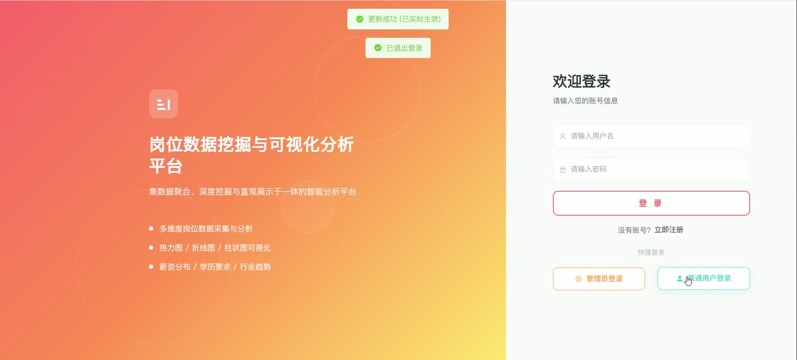
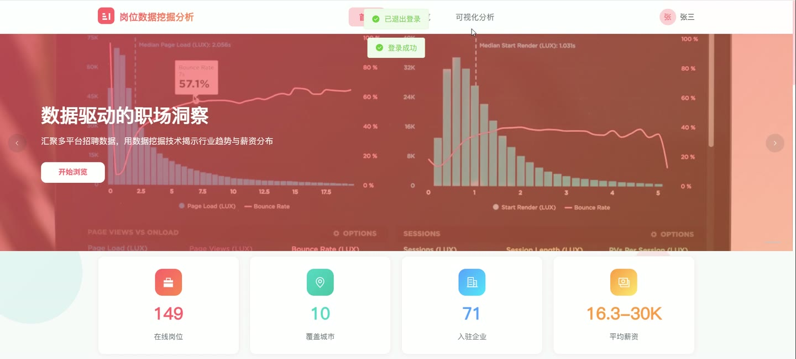
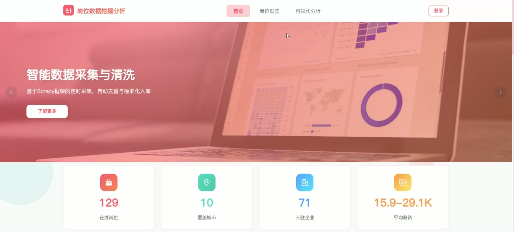
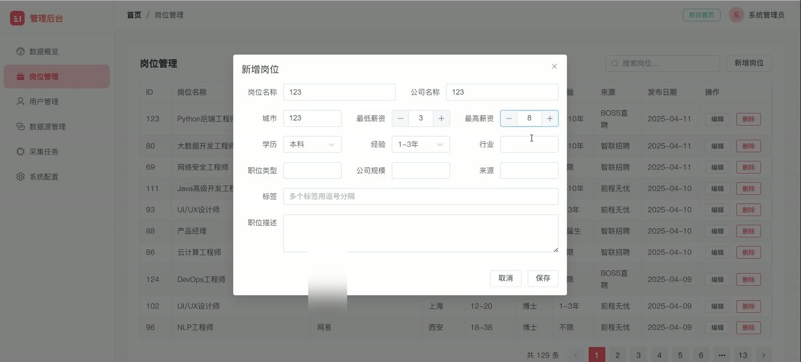
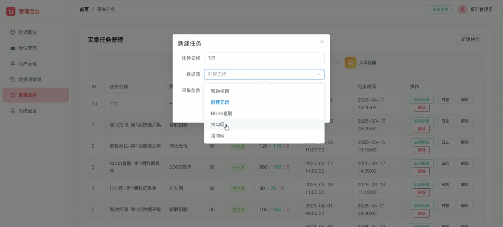

# (附文档)Python+Django+Vue3 招聘网站岗位数据挖掘与可视化分析系统

**技术栈**：Python、Django、Vue3、MySQL

### 系统简介

本系统是一套基于 Python + Django + Vue3 的前后端分离招聘岗位数据挖掘与可视化分析平台，后端通过 Django REST Framework 提供接口，前端使用 Vue3 单页应用承载全部页面。系统包含普通用户端与管理员端两类角色，覆盖岗位数据采集、清洗入库、多维统计分析与可视化展示的完整链路。
 
### 核心功能
 
### 普通用户端

 
- 用户注册：填写用户名、密码、昵称完成注册，校验用户名至少 3 个字符、密码至少 6 个字符，并受系统配置项 allow_register 控制是否开放注册。 
- 用户登录：输入用户名与密码登录，登录成功后返回 token 及用户角色信息，管理员自动跳转后台，普通用户进入前台首页。 
- 快捷登录：登录页提供管理员与普通用户两个快捷登录入口，一键填充演示账号完成登录。 
- 岗位列表浏览：分页展示岗位数据，支持按城市、学历、行业、经验、关键词、最低薪资、最高薪资多条件组合筛选。 
- 岗位详情查看：展示岗位名称、公司、城市、区域、薪资区间、学历、经验、职位类型、行业、公司规模、标签、职位描述、来源网址与发布日期。 
- 筛选条件获取：动态读取数据库中已有的城市、学历、行业、经验去重列表，用于生成前台筛选下拉选项。 
- 可视化分析查看：在可视化页面查看城市岗位分布、薪资区间分布、学历要求统计、行业统计、经验要求统计、各城市薪资对比、公司规模统计等图表。 
- 个人资料查看：登录后获取当前用户的昵称、角色、头像、邮箱、手机号等信息。 
- 头像上传：选择图片文件上传，系统按 UUID 重命名后保存并回写用户头像地址。 
- 退出登录：调用退出接口使当前 token 失效并清除本地登录状态。
 
### 管理员端

 
- 后台数据概览：展示岗位总数、用户数量、活跃数据源数、采集任务总数、已完成任务数、运行中任务数等统计卡片。 
- 概览图表展示：在后台首页渲染城市岗位分布柱状图与薪资区间统计折线图，并展示最近 5 条采集任务记录。 
- 岗位管理：分页查看岗位列表，支持关键词搜索岗位名称，展示薪资区间、学历、经验、来源、发布日期等字段。 
- 岗位新增与编辑：填写岗位名称、公司、城市、薪资上下限、学历、经验、行业、职位类型、公司规模、标签、职位描述、来源等字段保存，标签支持逗号分隔多值。 
- 岗位删除：对指定岗位执行删除操作。 
- 用户管理：查看用户列表，支持按用户名关键词检索，展示角色、邮箱、手机号、状态、头像与创建时间。 
- 用户新增与编辑：可修改昵称、邮箱、手机号、角色、状态，支持重置密码；新增用户可指定用户名、密码与角色。 
- 用户删除：删除指定用户，系统禁止删除管理员角色账号。 
- 数据源管理：查看数据源列表，展示名称、网址、类型、状态、最后采集时间与描述，网址支持点击跳转。 
- 数据源新增与编辑：维护数据源名称、网址、类型、启用状态与描述信息。 
- 数据源删除：删除指定数据源记录。 
- 采集任务管理：查看任务列表，展示任务名称、所属数据源、目标条数、状态、采集数/入库数/失败数、开始与结束时间，列表每 3 秒自动刷新。 
- 采集任务新增与编辑：配置任务名称、关联数据源、采集条数（5 至 500 条）与任务状态。 
- 采集任务启动：一键启动采集任务，触发 Scrapy 采集、数据清洗、去重标准化、入库存储流水线，运行中任务不可重复启动。 
- 任务日志查看：弹窗实时轮询展示任务日志，按时间、日志级别与消息内容分行渲染，运行中自动滚动到底部。 
- 采集任务删除：删除指定任务，运行中的任务禁止删除。 
- 系统配置管理：查看配置项列表，展示配置键、配置值与描述。 
- 系统配置新增与编辑：新增配置需校验配置键非空且唯一，编辑时可修改配置值与描述。 
- 系统配置删除：删除指定配置项。 
- 通用文件上传：上传文件后按 UUID 重命名保存，返回可访问的文件地址与原始文件名。
 
### 技术栈

 后端框架Python + Django + Django REST Framework 数据采集Scrapy 采集流程（采集、清洗、去重标准化、入库） 权限控制Token 鉴权，login_required 与 admin_required 装饰器分级校验 前端框架Vue3 + Vue Router UI 组件库Element Plus 可视化图表ECharts 状态管理Pinia（useUserStore） 构建工具Vite 数据库MySQL 核心数据表job_position、sys_user、data_source、crawl_task、system_config
 
### 交付内容

 
- 后端完整源码 
- 前端完整源码 
- 数据库初始化脚本 
- 万字文档

## 界面展示

---

## 获取完整源码 + 万字文档

本仓库为项目介绍页。**完整前后端源码、数据库初始化脚本、万字项目文档**，请加微信 `kangkangcode`，或访问 [codekk.top](http://codekk.top) 获取。

可作课程设计 / 毕业设计参考，支持远程部署调试。